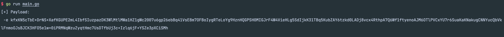

# Forest
基于frp(0.44.0)二次开发，删除不必要功能，加密配置文件，修改流量以及文件特征

## 简介

在网上多篇文章的熏陶下对frp的进行改造，对frps以及frpc进行隐蔽。

## 更改的地方

1. 使用RC4对配置文件加密，支持命令行传入以及配置文件读取解密。
2. 修改了frps和frpc默认salt
3. 更改tls模式下数据头为更难以识别的特征
4. 修改非tls下CS交互字段(不建议使用)
5. 更改websocket请求固定路径
6. ~~支持websocket域前置~~
7. 删除修改frp特征字段
8. 删去不常用功能
9. upx压缩后无文件落地(windows下通过两种主流方式内存加载)

## generate

通过RC4算法生成传入forestc和forests的加密字符串

### 用法

修改iniPath为配置文件路径运行即可

## forest

这几天会陆续release(原因是最新一版被我覆盖没了，而且没保存，只能从上一版重新搞...)
